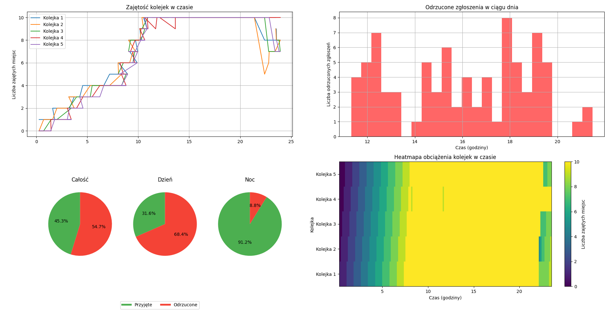

# Helpline Queueing Simulation

This repository contains a Python simulation of a helpline (call center) queueing system. The simulation models multiple queues with limited capacity, handling incoming calls with varying arrival rates and service times.

## Overview

The system simulates a helpline with:

- **Multiple queues** (agents or lines)
- **Queue capacity limits**
- **Time-varying call arrival rates** (day vs night)
- **Variable service times** for each call
- **Call rejection** when all queues are full

The simulation assigns incoming calls to the **shortest available queue**. Calls that cannot be accommodated are marked as rejected.

---

## Input Data

The simulation generates synthetic call data with the following parameters:

| Field        | Description |
|--------------|-------------|
`hours` | number of hours to simulate (default 24) |
`calls_per_hour_day` | average number of calls per hour during daytime (default 10) |
`calls_per_hour_night` | average number of calls per hour during nighttime (default 3) |
`min_service` / `max_service` | minimum and maximum service time per call (in minutes) |

Each call is represented as a record with:

| Field        | Description |
|--------------|-------------|
| `arrival_time` | The exact time (in hours) when the call arrives |
| `service_time` | Duration of the call in minutes |

The simulation function returns a dictionary containing:

| Key | Description |
|-----|--------------|
| `total_calls` | Total number of calls generated during the simulation |
| `accepted_calls` | Number of calls successfully placed in queues |
| `rejected_calls` | Number of calls rejected because all queues were full |
| `queues_final_state` | Number of calls remaining in each queue at the end of the simulation |
| `timeline` | Arrival times (in hours) of all generated calls |
| `occupancy` | Number of occupied places in each queue over time |
| `accepted_flags` | Boolean list indicating whether each call was accepted (`True`) or rejected (`False`) |

---

## Plots

The simulation produces a 2x2 grid of visualizations:

1. **Queue Occupancy Over Time**  
   - Line plot showing the number of calls in each queue as a function of time.

2. **Rejected Calls Histogram**  
   - Histogram showing how many calls were rejected at each hour of the day.

3. **Pie Charts: Accepted vs Rejected Calls**  
   - Three pie charts displayed together:
     - **Overall** – all calls
     - **Daytime** – calls arriving between 08:00–20:00
     - **Nighttime** – calls arriving between 20:00–08:00
   - Colors indicate accepted (green) vs rejected (red) calls. A single legend is displayed below the charts.

4. **Queue Occupancy Heatmap**  
   - Heatmap showing the occupancy of each queue over time.
   - **X-axis** – time in hours  
   - **Y-axis** – individual queues  
   - Color intensity indicates the number of calls in each queue at a given time
  
<p align="center">
  
  <br>
  <em>Figure 1: Example simulation results</em>
</p>

---

## Usage

1. Clone the repository:
```bash
git clone https://github.com/zacky111/Helpline-Queueing-Theory.git
cd Helpline-Queueing-Theory
```

2. Create venv and install required libraries:
``` bash
python -m venv venv
source venv/bin/activate
pip install -r requirements.txt
```